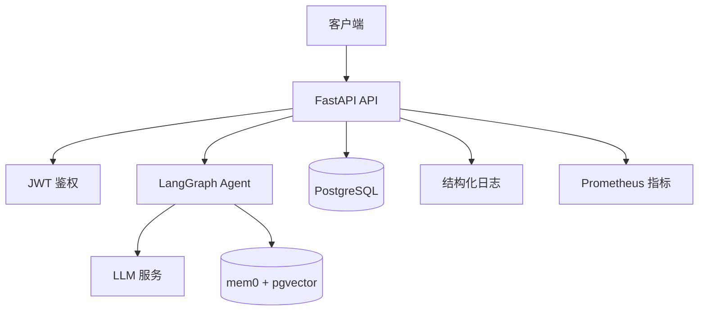

# 架构说明

## 总体架构



## 请求链路

一次普通聊天请求：

```text
客户端请求
  ↓
CorrelationIdMiddleware 生成 request_id
  ↓
LoggingContextMiddleware 绑定 user_id
  ↓
FastAPI 路由校验 token 和 session 归属
  ↓
LangGraph 获取 checkpoint 状态
  ↓
MemoryService 检索长期记忆
  ↓
LLMService 调用模型
  ↓
写入 chat_message 业务表
  ↓
后台更新长期记忆
  ↓
返回响应
```

## 数据分层

| 数据 | 存储位置 | 说明 |
| --- | --- | --- |
| 用户 | `user` | 登录账号 |
| 会话 | `session` | 聊天会话 |
| 问答记录 | `chat_message` | 业务聊天历史 |
| 图状态 | checkpoint 表 | LangGraph 内部状态 |
| 长期记忆 | mem0/pgvector | 用户事实和偏好 |

## 设计原则

- `chat_message` 保存业务可见的聊天历史
- checkpoint 表只服务于 LangGraph 状态恢复
- 长期记忆只保存提炼后的事实和偏好
- 日志使用结构化字段，便于 ES/Grafana 排查
- 指标使用 Prometheus，便于观察性能和错误率
