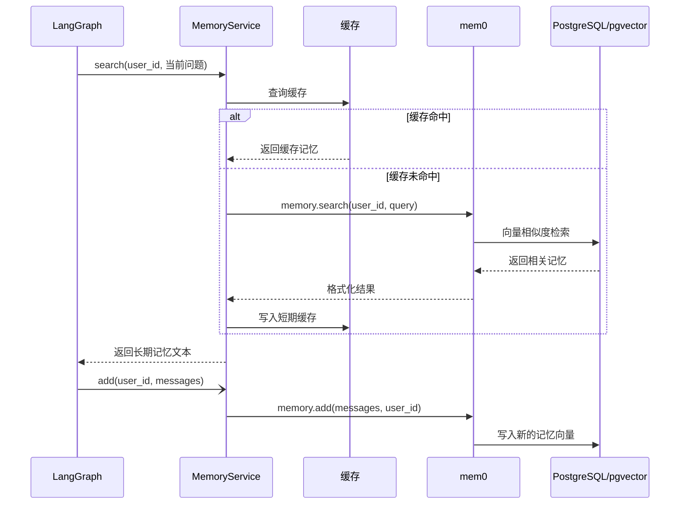

# 长期记忆

## 概览

项目使用 mem0 + pgvector 实现长期记忆。长期记忆不是完整聊天记录，而是从对话中提炼出的用户事实、偏好、计划和背景信息。

例如用户说：

```text
我喜欢蓝色衣服，明天准备去上海
```

mem0 可能会提炼出：

```text
喜欢蓝色衣服
明天准备去上海
```

## 工作流程



## 读取记忆

每次聊天时，系统会用当前问题检索长期记忆，然后把结果放入系统提示词：

```text
# What you know about the user
* 喜欢蓝色衣服
* 明天准备去上海
```

这样模型回答时就能参考用户历史偏好。

## 写入记忆

大模型回答完成后，系统会后台调用 mem0 更新记忆。这个过程不会阻塞聊天响应。

## 配置项

| 配置 | 说明 |
| --- | --- |
| `LONG_TERM_MEMORY_MODEL` | mem0 用来抽取和管理记忆的模型 |
| `LONG_TERM_MEMORY_EMBEDDER_MODEL` | 记忆向量化模型 |
| `LONG_TERM_MEMORY_EMBEDDING_DIMS` | 向量维度 |
| `LONG_TERM_MEMORY_COLLECTION_NAME` | pgvector collection 名称 |
| `CACHE_TTL_SECONDS` | 记忆检索缓存时间 |

## 用户隔离

所有长期记忆都按 `user_id` 隔离。用户只能检索自己的长期记忆。

## 和聊天记录的区别

| 类型 | 存储 | 用途 |
| --- | --- | --- |
| 聊天记录 | `chat_message` | 保存每一轮问题和答案 |
| 长期记忆 | mem0/pgvector | 保存用户偏好和重要事实 |
| checkpoint | LangGraph 表 | 恢复图状态 |
